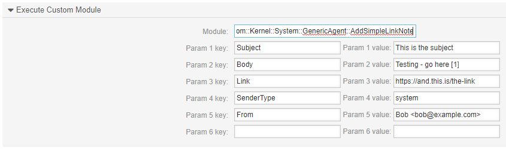
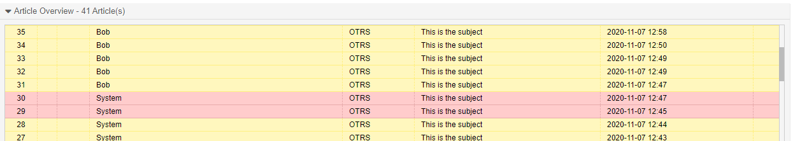
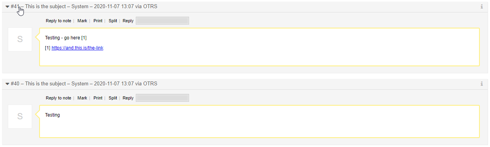

# add-simple-link-note

## AddSimpleLinkNote

OTRS Module intended to be run with GenericAgent

## Installation

Make sure target directory exists:

`mkdir -p $HOME/Custom/Kernel/System/GenericAgent`

Then copy `AddSimpleLinkNote.pm` to `Custom/Kernel/System/GenericAgent`

## Configuration

Execute Custom Module: `Custom::Kernel::System::GenericAgent::AddSimpleLinkNote`

Mandatory Param Keys:

* `Subject`
* `Body`

Optional Param Keys:

* `Link`
* `SenderType` (Default: system)
* `From` (Default: System <root@localhost>)

## Screenshots

